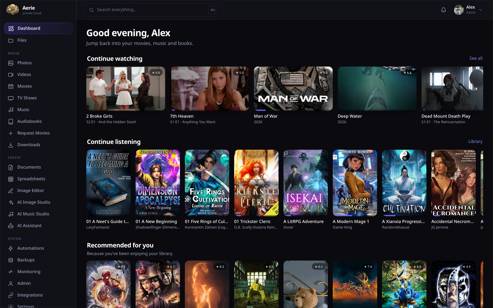
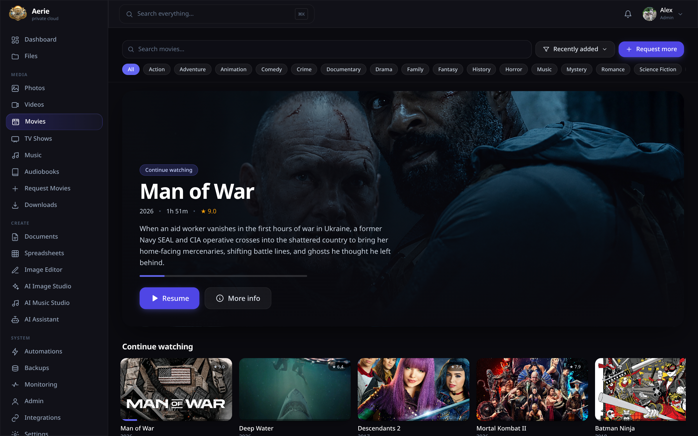
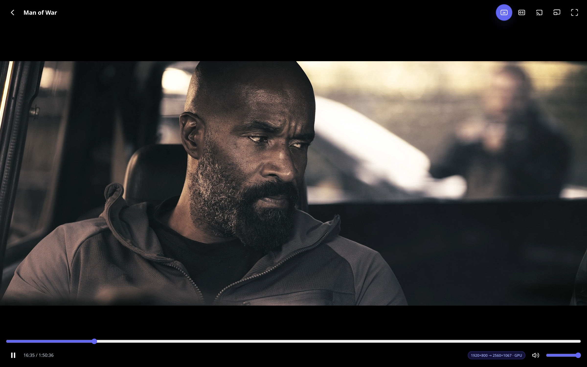
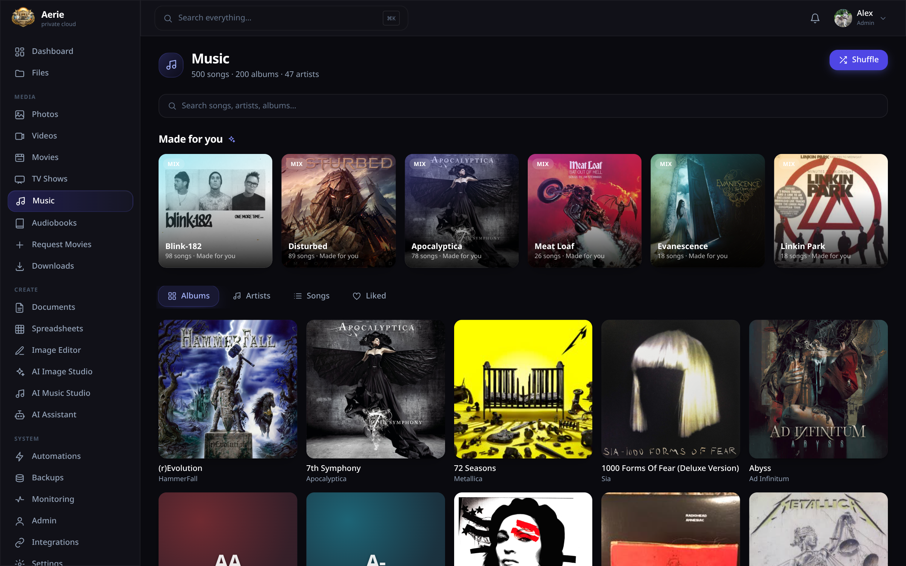
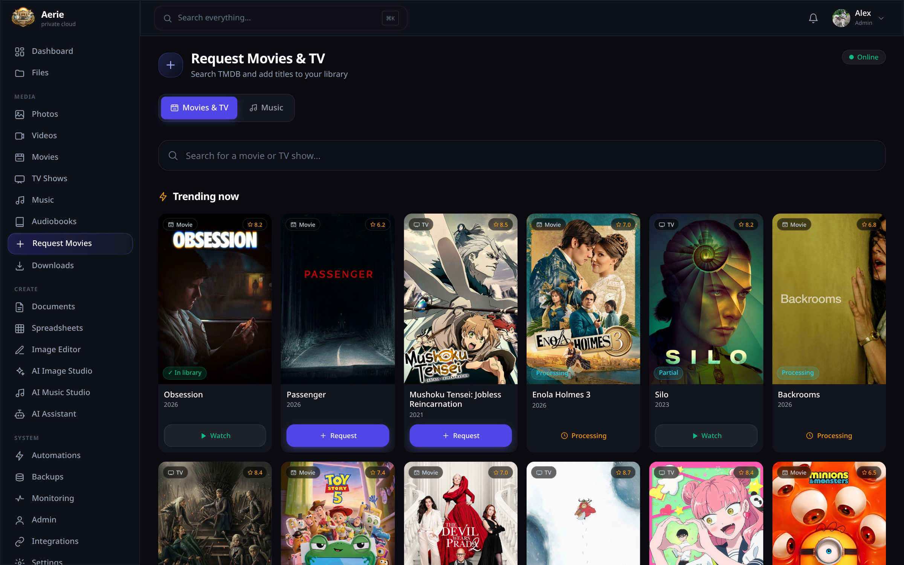
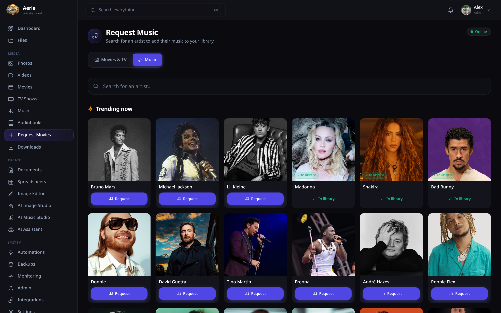
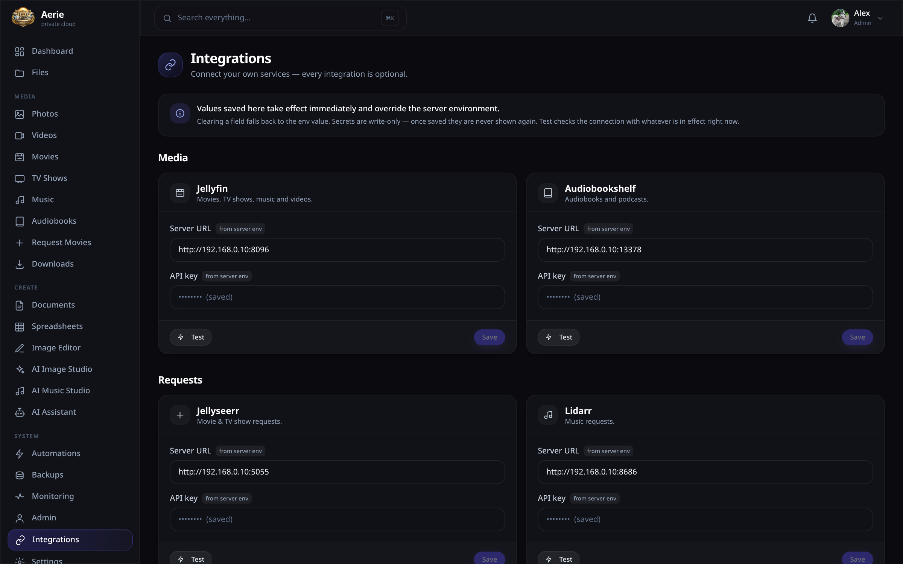

# Aerie

**Your entire digital life, self-hosted, in one app.** Aerie is a private-cloud hub that unifies your files, photos, movies, TV, music, audiobooks, documents and AI tools behind a single beautiful interface — powered by the self-hosted services you already run.



## What you get

- **Drive** — per-user file storage with uploads, sharing links, trash, versioning and full-text search
- **Docs & Sheets** — built-in document (WYSIWYG) and spreadsheet editors with a safe formula engine and charts
- **Photos** — albums, places map, object explorer and people, backed by [PhotoPrism](https://photoprism.app) (one instance per family member)
- **Movies, TV & Videos** — Netflix-style browsing, resume, subtitles and audio tracks, backed by [Jellyfin](https://jellyfin.org)
- **2K GPU upscaling** — a WebGL2 port of AMD FidelityFX Super Resolution 1.0 upscales 1080p to 1440p *on the viewer's own GPU* (Windows/Linux desktops)
- **TV casting** — server-side Google Cast: send any movie to a Chromecast straight from the web app, with pause/seek controls
- **Music** — albums, artists, AI "made for you" mixes, and a phone-friendly player with media-session controls
- **Audiobooks & Podcasts** — multi-file books, resume across devices, backed by [Audiobookshelf](https://www.audiobookshelf.org)
- **Requests** — family members request movies/TV via [Jellyseerr](https://github.com/Fallenbagel/jellyseerr) and music via [Lidarr](https://lidarr.audio), right from the app
- **AI suite** — chat assistant with tool use (search your files, storage reports, playlists), image generation & inpainting (ComfyUI), music generation (ACE-Step), and voice input (Whisper) — using a cloud API (DeepSeek) or fully local (Ollama)
- **Apps everywhere** — installable PWA plus native Windows/Linux desktop apps and an Android APK with media notifications and LAN/cloud auto-failover
- **Self-care** — TOTP 2FA, nightly SQLite backups, service monitoring, automations, admin panel

| | | |
|---|---|---|
|  |  |  |

Request new titles right from the app — movies & TV through Jellyseerr, and music (whole artist discographies) through your own Lidarr:

| | |
|---|---|
|  |  |

## How it works

Aerie is a single Docker container (Node/Express API + React web app). It doesn't replace your media stack — it **federates** it. Every integration is optional: leave its URL unset in the env and that feature simply reports "not configured" while everything else keeps working.

| Integration | Powers | Env vars |
|---|---|---|
| Jellyfin | Movies, TV, Videos, Music | `JELLYFIN_URL`, `JELLYFIN_API_KEY` |
| Audiobookshelf | Audiobooks, Podcasts | `ABS_URL`, `ABS_API_KEY` |
| PhotoPrism | Photos (per user) | `PP_INSTANCES` or `PP_<NAME>_URL`, `PP_USER`, `PP_PASSWORD` |
| Jellyseerr | Movie/TV requests | `JELLYSEERR_URL`, `JELLYSEERR_API_KEY` |
| Lidarr | Music requests | `LIDARR_URL`, `LIDARR_API_KEY` |
| DeepSeek (cloud) or Ollama (local) | AI assistant, doc/sheet AI | `DEEPSEEK_API_KEY` / `OLLAMA_URL` |
| ComfyUI | AI image generation | `SD_URL` |
| ACE-Step | AI music generation | `ACESTEP_URL` |
| Wyoming Whisper | Voice input | `WHISPER_URL` |

Files, Docs, Sheets, Shares, Backups and Automations are fully built-in and need nothing external.

**You don't need to touch a config file for any of this.** The admin **Integrations** page (sidebar → System → Integrations) lets you enter every service URL and API key from the browser, with one-click connection tests — values save to the database, apply instantly without a restart, and override the environment. Env vars remain fully supported as defaults/automation (see [`aerie.env.example`](aerie.env.example)); secrets saved in the app are write-only and never shown again.



It's also where you set your server's **public and LAN addresses** — the native apps learn both from the server and switch between them automatically (home Wi-Fi ↔ mobile data) without rebuilding or reconfiguring anything on the devices.

## Quick start (any Docker host)

```bash
git clone https://github.com/Eyonic/aerie.git
cd aerie
cp aerie.env.example aerie.env   # edit: add your service URLs + API keys
docker compose up -d --build
```

Open `http://YOUR-HOST:8200`. On first run Aerie creates an **admin** account and prints its password once to the container log:

```bash
docker logs aerie | grep -A3 'First run'
```

Log in, change the password (Settings → Security), optionally enable 2FA, and add accounts for your family in Admin.

## Installing on Unraid

Aerie was built on and for an Unraid home server. The `deploy/` scripts automate everything, including **harvesting the API keys from your existing containers' appdata** so you don't have to copy them by hand.

1. **Get the source onto the server** (SSH in as root — any path works; set `SRC_DIR` in `deploy.conf` if you pick a different one):
   ```bash
   git clone https://github.com/Eyonic/aerie.git /root/aerie-src
   cd /root/aerie-src
   ```
2. **Describe your setup** — copy the template and edit it:
   ```bash
   cp deploy/deploy.conf.example deploy/deploy.conf
   nano deploy/deploy.conf
   ```
   Set at minimum `HOST_IP` (your server's LAN IP). Point the `*_APPDATA` paths at your existing service appdata folders and list your PhotoPrism instances if you have them — `gen-env.sh` reads the API keys straight out of those services' own config files/databases.
3. **Deploy:**
   ```bash
   bash deploy/run.sh
   ```
   This generates `/mnt/user/appdata/aerie/aerie.env`, builds the Docker image, and starts the `aerie` container on port 8200 with `/mnt/user/appdata/aerie/{data,files,downloads}` volumes and your media share mounted read-only.
4. **First login:** `http://SERVER-IP:8200` — see the container log for the generated admin password (`docker logs aerie`).
5. **HTTPS (recommended):** several features are browser-gated to secure contexts — microphone/voice, browser casting, offline downloads and PWA install only work over HTTPS. Put any reverse proxy in front (Nginx Proxy Manager, Caddy, Traefik, Cloudflare Tunnel) targeting `SERVER-IP:8200` with websockets enabled, proxy buffering off, and generous timeouts/body size for uploads and long streams. If you use Nginx Proxy Manager, `deploy/npm-proxy.sh` is a working example. Set `PUBLIC_URL` in `deploy.conf` to your HTTPS address so the UI can point people at it.
6. **Update later:** `git pull && bash deploy/run.sh` — your `deploy.conf`, env and data are preserved.

## Native apps

The **Get Apps** page serves whatever installers you place in the `/downloads` volume. Build them yourself from `apps/` — optionally baking in your server's address so your family never types a URL:

```bash
export AERIE_DEFAULT_URL=https://cloud.example.com   # optional
export AERIE_LAN_URL=http://192.168.0.10:8200        # optional (Android failover)
./apps/build-desktop.sh    # Windows .exe + Linux AppImage/.deb (Docker)
./apps/build-android.sh    # Android APK (Docker)
```

Copy the artifacts into `<appdata>/aerie/downloads/`. Details, signing notes and caveats: [`apps/README.md`](apps/README.md). The Android app adds OS media controls and automatic LAN↔cloud switching with session handoff; the desktop app is a slim wrapper around your server's web UI, so it updates itself whenever you redeploy the server.

## The 2K GPU upscaler

Movies stored in 1080p can be rendered at 2560×1440 by the *viewing* machine: the player pipes every decoded frame through a WebGL2 port of AMD FidelityFX Super Resolution 1.0 (EASU + RCAS). Toggle it with the **2K** button in the player — the badge shows the live pipeline (`1920×800 → 2560×1067 · GPU`). Desktop Windows/Linux only; the server never transcodes for it, so it costs the server nothing.

## Security notes

- Sessions are JWT-based; the secret comes from `JWT_SECRET` or is generated once and persisted under `/data`.
- The first-run admin password is random unless you set `ADMIN_USER`/`ADMIN_PASSWORD`; a `demo/demo` account is only created if you opt in with `SEED_DEMO=1`.
- Optional TOTP two-factor auth per account (Settings → Security).
- Media/photo API keys live server-side only; the browser only ever sees Aerie session tokens.
- Nightly `VACUUM INTO` database backups with one-click restore (Backups page).

## License

MIT — see [LICENSE](LICENSE). Includes a port of AMD FidelityFX Super Resolution 1.0 and OpenStreetMap-based maps; attributions in [THIRD_PARTY_NOTICES.md](THIRD_PARTY_NOTICES.md).

## want to make this even better

<a href="https://www.buymeacoffee.com/Eyonic" target="_blank"></a>
